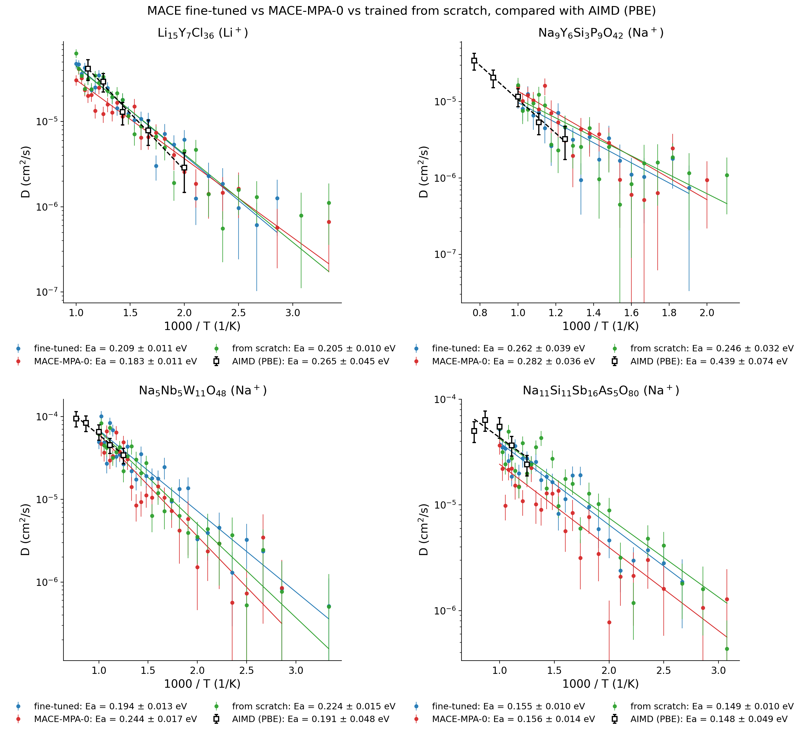
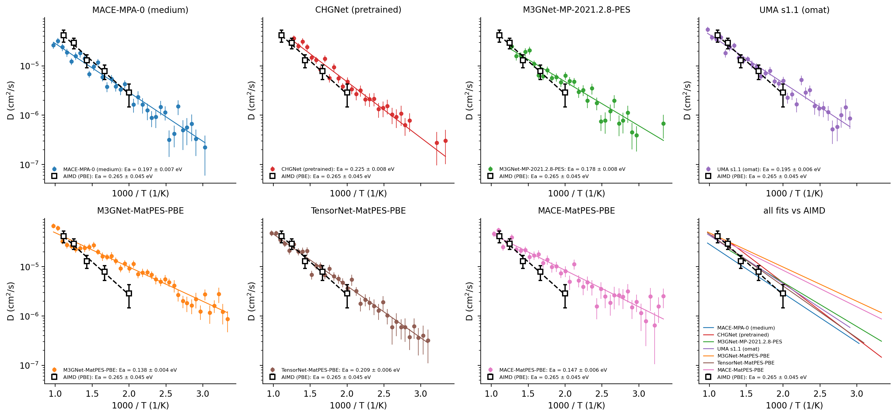
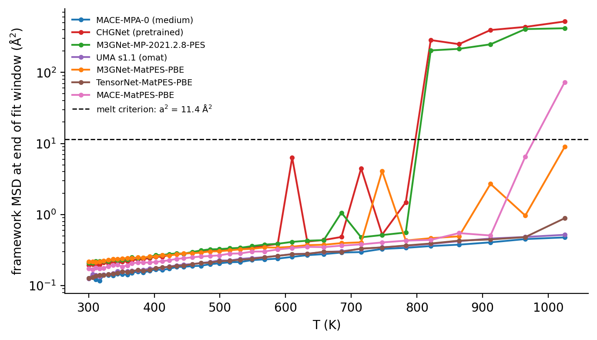
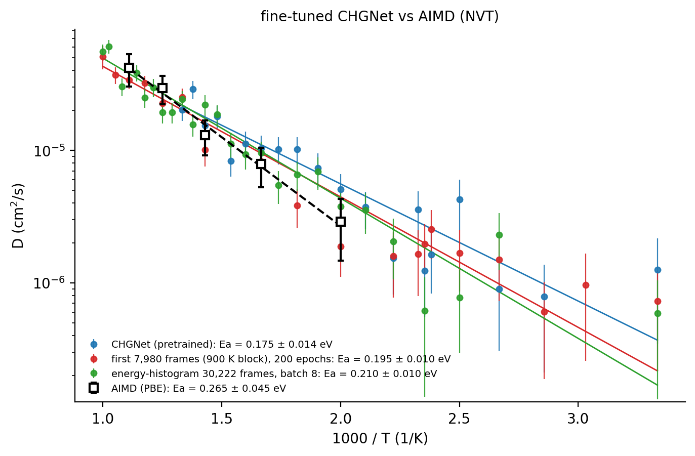
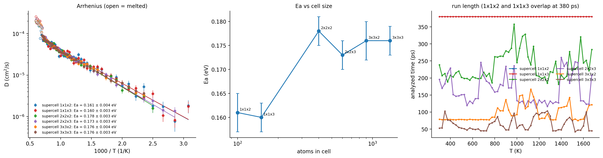

# Ionic transport from ML-potential MD

Li and Na diffusion, activation energies and conductivities from molecular dynamics with foundation
potentials (FPs), fine-tuned models and models trained from scratch, compared with AIMD (PBE) analyzed
with exactly the same code. Notebooks:
[03](../notebooks/03_lyc_foundation_potentials_md.ipynb),
[04](../notebooks/04_mace_finetuned_vs_foundation_md.ipynb),
[05](../notebooks/05_chgnet_finetuned_lyc_md.ipynb),
[06](../notebooks/06_lgps_supercell_size.ipynb),
[07](../notebooks/07_aimd_reference.ipynb).

## Method (all studies)

Diffusivities are computed with [`iondiff`](../iondiff), which implements the statistical analysis of
X. He, Y. Zhu, A. Epstein, Y. Mo, *npj Comput. Mater.* **4**, 18 (2018):

* time-averaged (FFT) mean squared displacement of the mobile ion, framework drift removed, linear
  fit between MSD = 0.5 a² and 0.8 of the trajectory length (a = 3.38 Å);
* statistical error of D from the number of ion jumps, RSD = 3.43/√Njump + 0.04;
* Arrhenius fit of log10D vs 1000/T weighted by those errors, with temperatures at which
  the host framework melted (framework MSD > a²) excluded;
* consecutive MD/AIMD jobs are stitched into one trajectory only after checking that each job starts
  where the previous one ended.

## 1. Fine-tuned MACE reproduces AIMD diffusivities ([notebook 04](../notebooks/04_mace_finetuned_vs_foundation_md.ipynb))

Four conductors (Li15Y7Cl36 and three Na-ion oxides), MD at 29
temperatures (300-1000 K, 400 ps each) with three MACE models per material. Squares: AIMD (PBE).

| material | Dmodel/DAIMD, fine-tuned | from scratch | MACE-MPA-0 (no fine-tuning) |
|---|---|---|---|
| Li15Y7Cl36 (500-900 K) | 0.83-1.39 | 0.82-1.44 | 0.58-1.27 |
| Na9Y6Si3P9O42 (800-1000 K) | 0.84-1.41 | 0.93-1.64 | 1.18-1.87 |
| Na5Nb5W11O48 (800-1000 K) | 1.05-1.18 | 1.03-1.12 | 0.88-0.99 |
| Na11Si11Sb16As5O80 (800-1000 K) | 0.71-1.03 | 0.77-1.14 | 0.44-0.64 |

Fine-tuned MACE stays within a factor of 1.41 of AIMD in every material; the foundation model alone
deviates by up to 2.3×.

## 2. Seven foundation potentials on Li15Y7Cl36 ([notebook 03](../notebooks/03_lyc_foundation_potentials_md.ipynb))

Each potential was run at 40 temperatures (300-1025 K), 0.4-1.6 ns per temperature (about 0.8 ns on average; 1-4 consecutive 400 ps jobs).

| FP | Ea, all T (eV) | Ea, 500-900 K (eV) | σ(300 K), extrapolated (mS/cm) |
|---|---|---|---|
| AIMD (PBE) | | 0.265 ± 0.045 | |
| MACE-MPA-0 (medium) | 0.197 ± 0.007 | 0.185 | 9.4 |
| CHGNet | 0.225 ± 0.008 | 0.269 | 9.9 |
| M3GNet-MP-2021.2.8-PES | 0.178 ± 0.008 | 0.217 | 21.0 |
| UMA s1.1 (omat) | 0.195 ± 0.006 | 0.220 | 15.2 |
| M3GNet-MatPES-PBE | 0.138 ± 0.004 | 0.104 | 79.5 |
| TensorNet-MatPES-PBE | 0.209 ± 0.006 | 0.202 | 10.9 |
| MACE-MatPES-PBE | 0.147 ± 0.006 | 0.148 | 59.2 |

* Over the AIMD window, CHGNet, UMA, M3GNet-PES and TensorNet-MatPES-PBE agree with AIMD within 1.3
  combined standard deviations; the two MatPES models with the fastest diffusion are 0.12-0.16 eV lower
  and overestimate D at 500 K by about 3×.
* CHGNet and M3GNet-PES melt the Li-Y-Cl framework at 821 K and above; including those temperatures in
  the fit would raise their Ea to 0.246 and 0.223 eV.

## 3. Fine-tuned CHGNet: NVT vs NPT, and 5 ns runs ([notebook 05](../notebooks/05_chgnet_finetuned_lyc_md.ipynb))

* **NVT (AIMD volume):** the 13 fine-tuned models give D within a factor of 2 of AIMD at 500-900 K;
  Ea over 500-900 K ranges from 0.160 to 0.266 eV (AIMD 0.265 ± 0.045 eV). Fine-tuning also
  stabilizes the framework: pretrained CHGNet melts at 10 of 32 temperatures, the fine-tuned models at
  0-2.
* **NPT:** models fine-tuned on energies and forces only expand the cell by 25-33% (pretrained CHGNet:
  13%), which makes D about 10× too high and melts the framework at 425-600 K. Accurate forces (test
  MAE 0.015-0.036 eV/Å) do not guarantee a correct equation of state; NPT needs stress in training.
* **Long runs:** NPT runs targeting 5 ns (3.5-6.1 ns reached, 52 ns in total) halve the statistical
  uncertainty of D relative to 400 ps runs (RSD 0.08-0.17 vs 0.15-0.37).

## 4. Finite-size effects in Li10GeP2S12 ([notebook 06](../notebooks/06_lgps_supercell_size.ipynb))

Six supercells from 100 to 1,350 atoms with MACE-MPA-0. Ea converges from 400 atoms on
(0.173-0.178 eV); the 100- and 150-atom cells give 0.160 eV and a 1.5× higher room-temperature
conductivity. The framework melts at 1400-1450 K in every cell.

## 5. AIMD reference ([notebook 07](../notebooks/07_aimd_reference.ipynb))

AIMD data: Mo group, University of Maryland (VASP, PBE, NVT). For Li15Y7Cl36,
an activation energy of 0.19 eV was reported earlier ([doi:10.1002/anie.201901938](https://doi.org/10.1002/anie.201901938));
all AIMD values in this repository are a reanalysis of the AIMD trajectories used for training, with
the same code and settings as the MD, so that MD and AIMD are compared like for like.

The AIMD used to train the LYC and Na-conductor models, analyzed with the same settings:
Ea = 0.265 ± 0.045 eV (LYC), 0.439 ± 0.074 (Na9Y6Si3P9O42),
0.191 ± 0.048 (Na5Nb5W11O48) and 0.148 ± 0.049 eV
(Na11Si11Sb16As5O80). 12 of 20 diffusivities agree
within 5% with an earlier analysis of the same AIMD, the rest within about two statistical
uncertainties.

## Caveats

* AIMD runs are short (68-430 ps per temperature), so AIMD Ea carries ±0.045-0.074 eV.
* For the Na conductors the MD (300-1000 K) and AIMD (800-1300 K) overlap only at 800-1000 K; compare
  diffusivity ratios there rather than activation energies.
* The fine-tuned-CHGNet MD used CHGNet's default Berendsen thermostat; all other MD used Nosé-Hoover.
