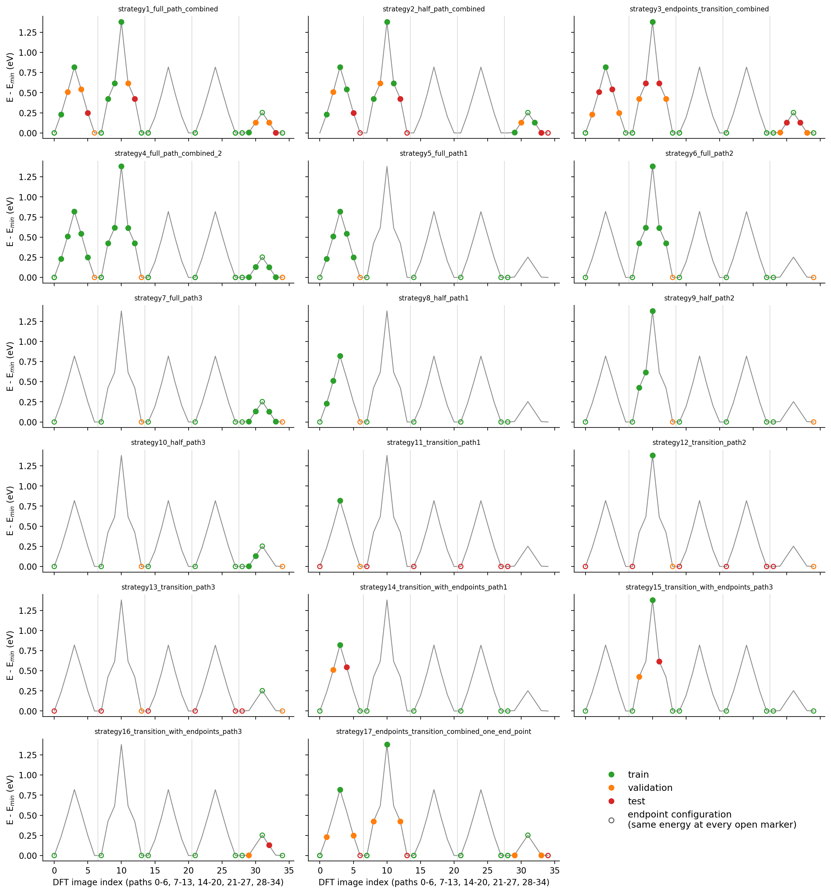
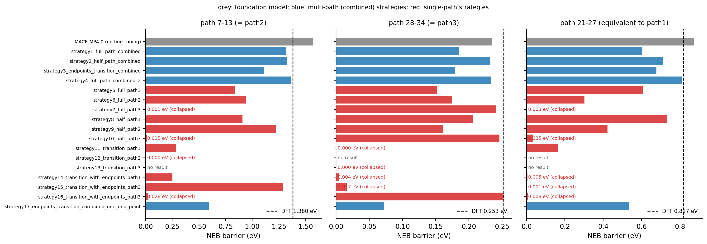
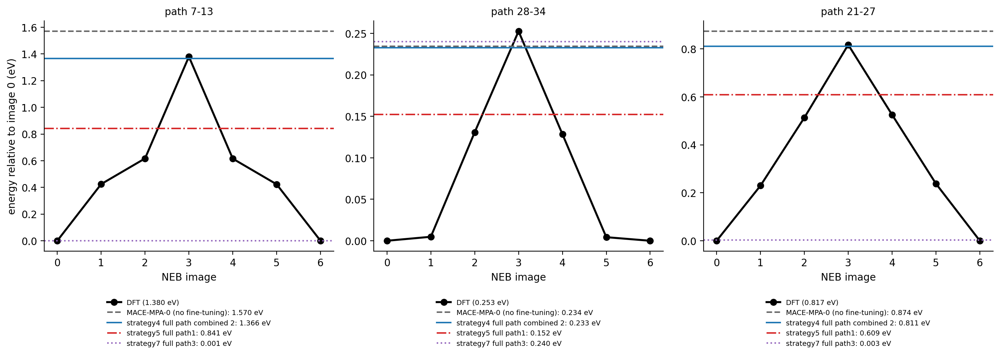
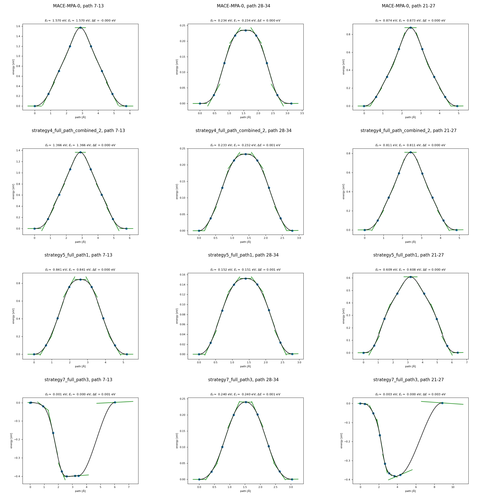

# Which DFT NEB images should a foundation model be fine-tuned on?

Na vacancy migration in Na2O (Na7O4, 11 atoms). MACE-MPA-0 (medium) was
fine-tuned on 17 different selections of DFT (VASP) NEB images, and every model was then used for a
climbing-image NEB (matcalc, 7 images, fmax = 0.05 eV/Å, endpoints relaxed with the model).
Notebook: [02_na2o_neb_image_selection](../notebooks/02_na2o_neb_image_selection.ipynb).

## The training sets

The 35 DFT images form five paths, but only three distinct hops: paths 0-6, 14-20 and 21-27 are
symmetry-equivalent (pymatgen `StructureMatcher`, all 7 images), so path 21-27 tests a hop equivalent
to path1 rather than an unseen one.

## Barriers vs DFT

| model | path 7-13 (eV) | path 28-34 (eV) | path 21-27 (eV) | mean abs. error (eV) |
|---|---|---|---|---|
| DFT | 1.380 | 0.253 | 0.817 | |
| MACE-MPA-0 (no fine-tuning) | 1.570 | 0.234 | 0.874 | 0.088 |
| strategy 4: all images of the three hops | 1.366 | 0.233 | 0.811 | 0.013 |
| strategy 2: half of each path | 1.321 | 0.232 | 0.711 | 0.062 |
| strategy 5: all images of path1 only | 0.841 | 0.152 | 0.609 | 0.283 |
| strategy 7: all images of path3 only | 0.001 | 0.240 | 0.003 | 0.735 |

## Findings

* Fine-tuning on every image of all three hops (strategy 4) reproduces the DFT barriers to 0.013 eV on
  average, against 0.088 eV for the foundation model, which overestimates the 1.38 eV barrier by 0.19 eV.
* Fine-tuning on a single path distorts the others: training on path3 alone collapses the other two
  barriers to almost zero.
* Even the symmetry-equivalent hop is not reproduced from one path's images: strategy 5 trains on all
  of path1 and predicts 0.609 eV for path 21-27 (DFT 0.817 eV), worse than the untuned foundation model.
* Each strategy is trained on 1-18 frames, so per-frame test errors are not meaningful here; the NEB
  barriers are the test.

