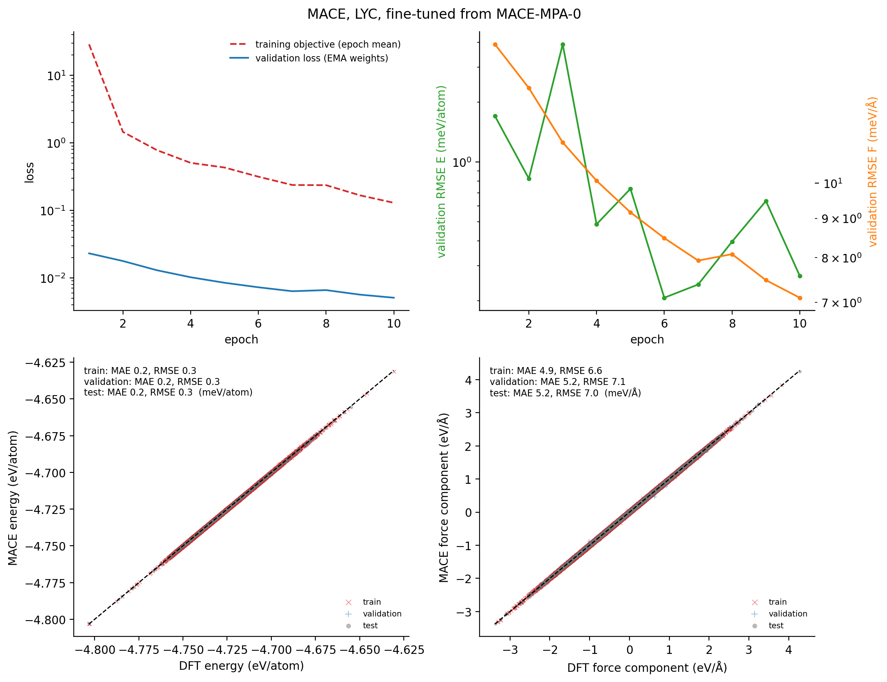
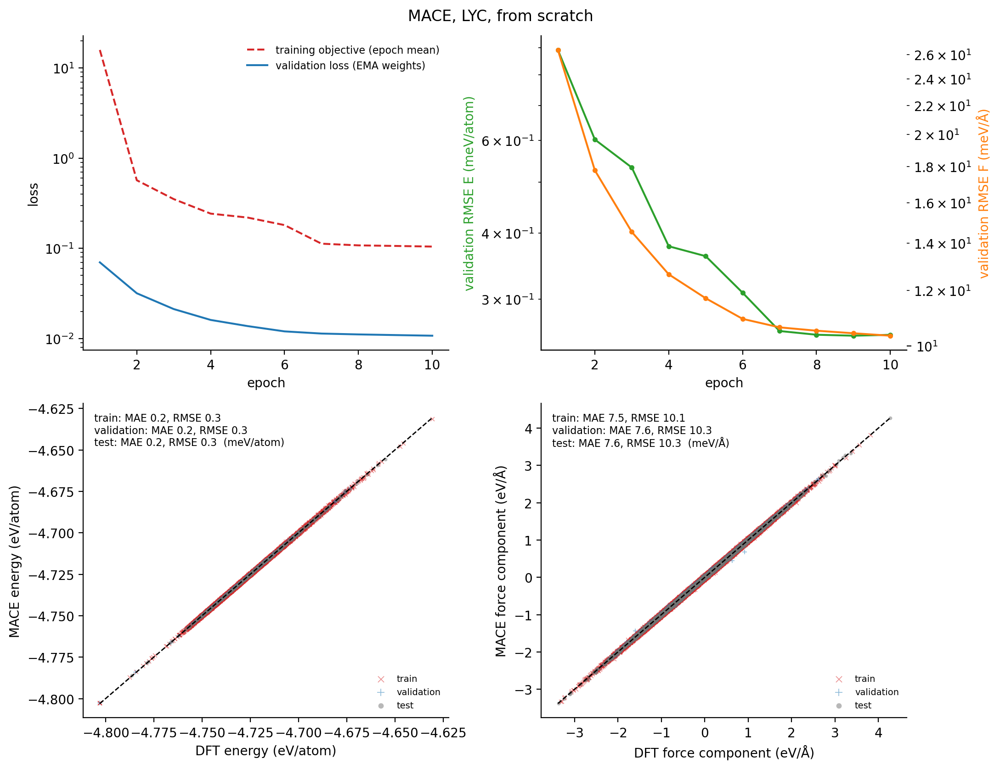
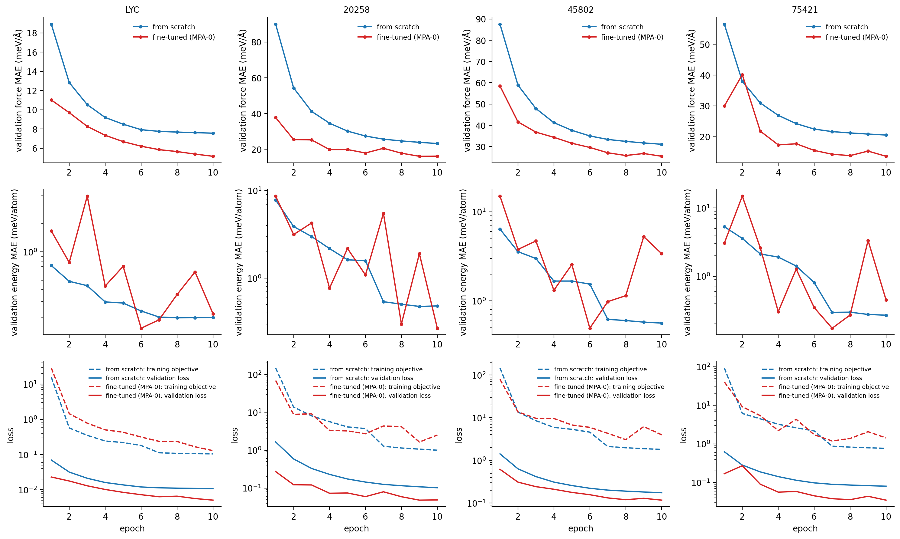
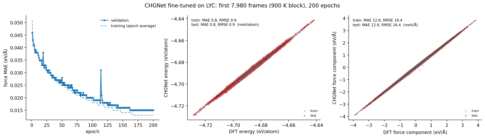
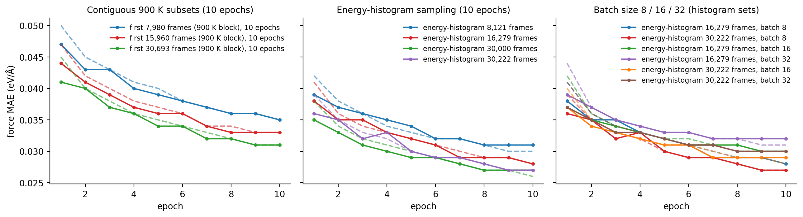
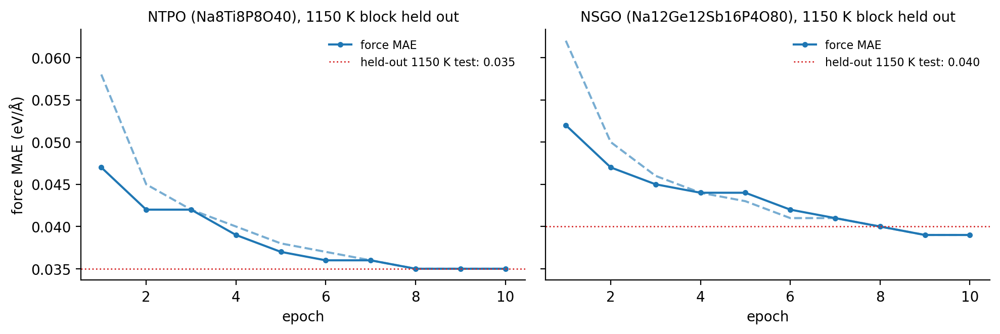

# Training and fine-tuning CHGNet and MACE

Per-epoch training/validation curves, parity plots and test errors of every model used in the
other studies. Notebook: [01_training_curves](../notebooks/01_training_curves.ipynb). Curves are
parsed from the original training logs (`scripts/parse_training_logs.py`); parity plots come from
evaluating each saved model on its own train/validation/test frames (`scripts/parity_predictions.py`),
and the recomputed test errors reproduce the logged ones (e.g. MACE Li15Y7Cl36
from scratch: test force RMSE 10.3 meV/Å in both).

## MACE: from scratch vs fine-tuned from MACE-MPA-0

Four conductors, each trained on its own AIMD data (energies and forces): Li15Y7Cl36
(LYC) and three Na-ion oxides (Na9Y6Si3P9O42,
Na5Nb5W11O48, Na11Si11Sb16As5O80).
From scratch: 128x0e+128x1o, 2 interactions, correlation 3, rmax 5 Å, 10 epochs, EMA + SWA.
Fine-tuned: MACE-MPA-0 (medium), same data and epochs.

| material | validation force MAE, from scratch (meV/Å) | fine-tuned (meV/Å) |
|---|---|---|
| Li15Y7Cl36 | 7.6 | 5.2 |
| Na9Y6Si3P9O42 | 23.3 | 16.2 |
| Na5Nb5W11O48 | 31.1 | 25.4 |
| Na11Si11Sb16As5O80 | 20.5 | 13.6 |

Fine-tuning from the foundation model lowers the force error in every material with the same data
and number of epochs. Parity figures for every MACE run are in [`figures/training`](../figures/training).

## CHGNet fine-tuning on Li15Y7Cl36

Pretrained CHGNet (412,525 parameters, all layers trainable) fine-tuned on 399,000 AIMD frames
(500-900 K, MP2020-corrected energies), comparing two ways of choosing the training frames:
contiguous subsets of the frame table (900 K frames only) and an energy-histogram scheme that draws
frames evenly across the energy distribution of all temperatures.

| training set | frames | epochs | test force MAE (eV/Å) |
|---|---|---|---|
| contiguous, 900 K | 7,980 / 15,960 / 30,693 | 10 | 0.036 / 0.033 / 0.032 |
| contiguous, 900 K | 7,980 | 200 | 0.015 |
| energy histogram, all T | 8,121 / 16,279 / 30,000 / 30,222 | 10 | 0.031 / 0.029 / 0.026 / 0.027 |
| energy histogram, batch 16 / 32 | 16,279 and 30,222 | 10 | 0.028-0.031 |

* Longer training matters most: 200 epochs on 7,980 frames reaches 0.015 eV/Å.
* At 10 epochs the energy-histogram sets reach 0.026-0.031 eV/Å; batch size (8/16/32) changes the
  error by at most 0.003 eV/Å.

## CHGNet fine-tuning on Na-ion oxides, unseen temperature

NTPO (Na8Ti8P8O40) and NSGO (Na12Ge12Sb16P4O80),
25,000 AIMD frames each, with the entire 1150 K block held out as the test set: test force MAE 0.035
and 0.040 eV/Å on the unseen temperature.

## Notes

* Splits are random within correlated AIMD trajectories (except the held-out temperature above), so
  test errors measure interpolation within the sampled temperature range.
* How these models behave in MD, including against AIMD, is in [md_studies](../md_studies).
